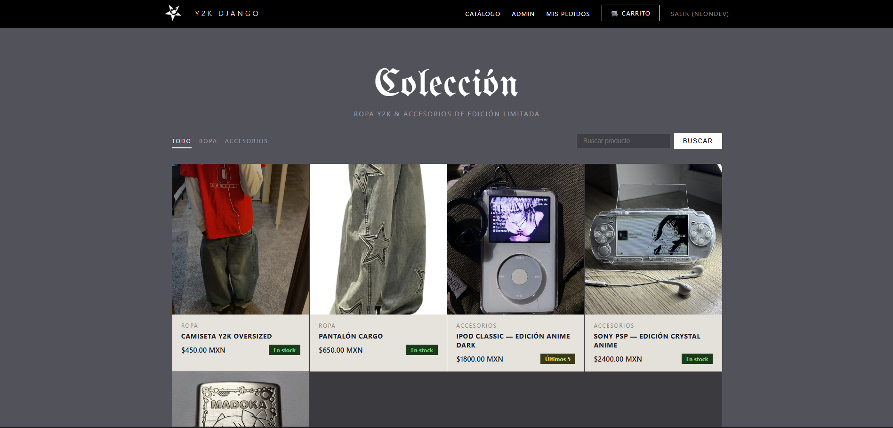
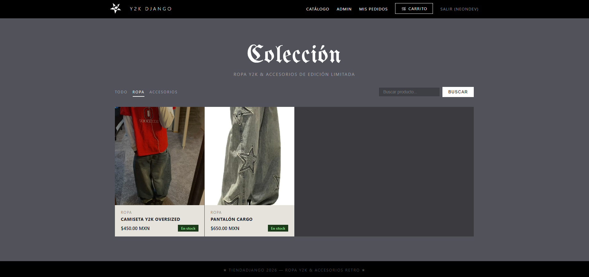
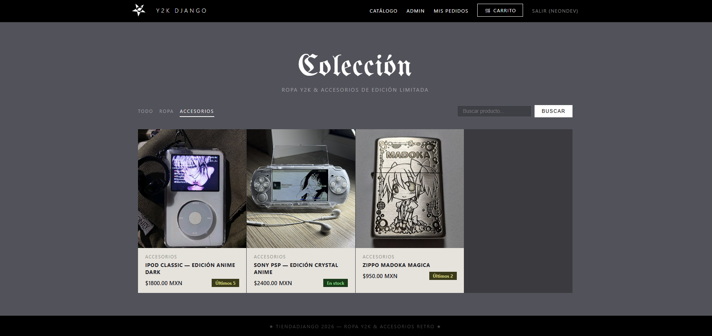

# Y2K Django

Tienda de ropa Y2K y accesorios de edición limitada. Proyecto desarrollado con Django 6 y SQLite.

## Vista previa





## Funcionalidades

- Catálogo de productos con filtros por categoría y buscador
- Autenticación de usuarios (registro, login, logout)
- Panel de administración para gestionar productos y stock
- Badges de stock (En stock / Últimos X / Agotado)
- Imágenes de productos subidas desde el admin

## Tecnologías

- Python 3.14
- Django 6.0.5
- SQLite
- Pillow
- HTML + CSS vanilla

## Instalación

```bash
# Clonar el repositorio
git clone https://github.com/neondev87/Ecomerce-Y2Z.git
cd Ecomerce-Y2Z/tiendadjango

# Crear y activar entorno virtual
python -m venv venv_tienda
venv_tienda\Scripts\activate

# Instalar dependencias
pip install django pillow

# Aplicar migraciones
python manage.py migrate

# Crear superusuario
python manage.py createsuperuser

# Correr el servidor
python manage.py runserver
```

## Estructura

```
tiendadjango/
├── productos/    ← catálogo y stock
├── carrito/      ← carrito de compras
├── pedidos/      ← órdenes e historial
├── usuarios/     ← autenticación
├── templates/    ← archivos HTML
└── static/       ← CSS e imágenes
```
